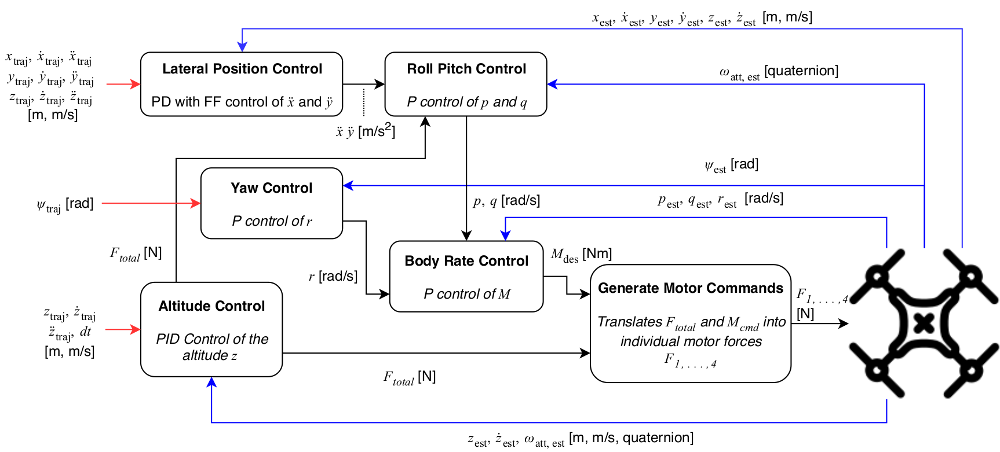

# Control System for Quadrotor

## Control Architecture

* To stably control a second order system without oscillations, a PD-controller is needed at least.
* For the first order systems, a P-controller is needed at least.

## PID controller

* P part of the controller is the main part. But only with P part, the controlled variable can oscillate unstably.
* D part of the controller can control the goal variable according to the changing rate of the feedbacks, for example, it can decrease the goal variable, when the controlled variable is changing too fast.
* I part of the controller can compensate the offset.

### Tuning of the PID parameters

* First set k_p to obtain a acceptable oscillation.
* Set k_d appropriately to abtain a stable controlled curve.
* Set k_i to compensate the possible offset.

## Thrusts for each propellers

There are **four** forces `F_0, F_1, F_2, F_3` called thrusts needing to be calculated, given the collective thrust command `F_c`, the moment commands `M_p, M_q, M_r` for each axis in the body frame.

We can form four equations from the known given commands and use algebra to solve these equations, to get the thrusts for each propeller.

## Body Rate control

Given the measured rotation speed `pqr` in the body frame, and the rotations speed commands `pqrCmd`, the moment `M` for each axis should be calculated.

A P-controller is used here for the body-rate-control, because this is a first order controller.

## Roll pitch control

Given the acceleration command `\ddot{x}`, `\ddot{y}` in `x` and `y` directions, the estimated quaternion `attitude`, and the whole thrust command `collThrustCmd`, the rotation rates `pqrCmd` in body frame should be calculated.

A P-controller is used for the control of moments around each body-axis, because of the first order system (the quaternion is only used for the calculation of the rotations matrix).

## Altitude control

Given the position, velocity command, the estimated position and velocity in `z` direction, the estimated quaternion `attitude` and the acceleration command in `z` direction, the total thrust `F` should be calculated.

A PID-controller is used, due to the second order system.

## lateral position control

Given the position command `posCmd` (point on the trajectory), velocity command `velCmd`, the estimated position and velocity, and the feed-forward acceleration command, the acceleration command in `xy` direction should be calculated.

A PD-controller is used, due to that the system is second order.

## yaw control

Give the estimated `yaw` and the yaw command `yawCmd`, the command for yaw rate `yawRateCmd` is calculated.

A P-controller is used, because of the first order system. 

## References
* [Udacity Flying Car Nanodegree](https://www.udacity.com)
* [original repository from Udacity](https://github.com/TrW236/FCND-Controls-CPP)
* [convert outputs to motor thrusts](https://www.overleaf.com/read/thzntmhcqkkp#/63267348/) - A. Karpinska